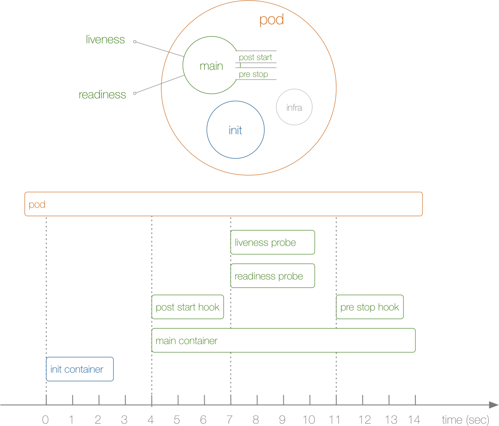
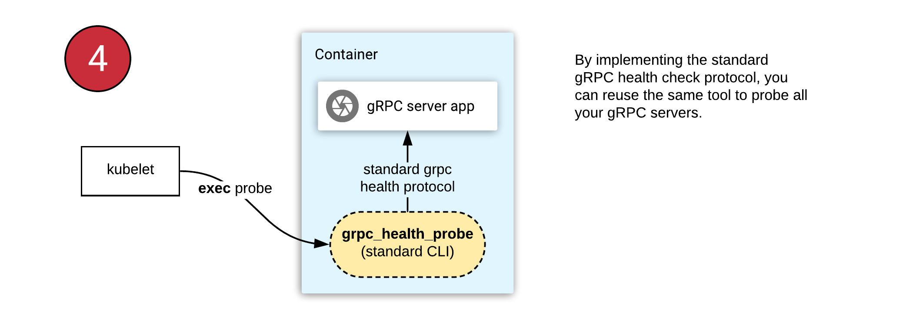
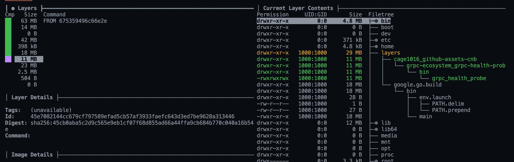

# Build Kuberntes GRPC Health Probe with Pack


<!--more-->



在 Kubernetes Pod 完整的生命周期包含了三個部份: `Iinit container` `Pod Hook` `健康檢查`。這三部都會影響到 Pod 的生命周期，而本篇文章說明如何使用 pack 打包 [grpc-health-probe](https://github.com/grpc-ecosystem/grpc-health-probe/) 來支援 GRPC 健康檢查

### Kubernetes livenessProbe & readinessProbe

[Configure Liveness, Readiness and Startup Probes | Kubernetes](https://kubernetes.io/docs/tasks/configure-pod-container/configure-liveness-readiness-startup-probes/)

在 Kubernetes cluster 中我們可以通過配置 `livenessProbe` 及 `readinessProbe` 二個探針來影響容器的生命周期

- `livenessProbe`: 簡單的來說就是 Kubectl 通過 `livenessProbe` 來判斷容器是否存活 (Running)，如果 livenessProbe 探針偵測到容器不健康，Kubectl 就會刪除容器，並依據容器的重啟策略來處理，如果容器不包含 livenessProbe 探針，Kubectl 預設就會認定 livenessProbe 探針回傳值永遠為 Success

- `readinessProbe`: 簡單的來說就是 Kubectl 通過 `livenessProbe` 來判斷容器的可用性 (Ready)，只有 Pod 下面所有容器的狀態都是就緒時，Kubectl 才會認定該 Pod 已經處於可工作狀態。如果該 Pod 執行過期中 Ready 狀態變成 False，系統會將其從 Service 的後端 Endpoints 列表中移除，等待 Pod Ready 狀態再度成為 True 時加為 Service Endpoints 列表，這樣可以確認流量不會被導至不可用的 Pod

在配置 `livenessProbe` 及 `readinessProbe` 都有三種指定方式

1. `ExecAction`: 在容器中執行指令，回傳值為 0 表示健康
1. `TCPSocketAction`: 透過容器的 IP 及 Port 進行檢查，如果可以建立 TCP 連線表示健康
1. `HTTPGetAction`: 透過容器的 IP 及 Port 進行 HTTP GET 檢查，如果回傳狀態碼介於 200 - 400 表示健康

### Health checking gRPC servers on Kubernetes


(ref: https://kubernetes.io/blog/2018/10/01/health-checking-grpc-servers-on-kubernetes/)

本篇文章因為要檢查 GRPC 服務是否健康，則屬於第一種 `ExecAction` 的範籌。[Health checking gRPC servers on Kubernetes | Kubernetes](https://kubernetes.io/blog/2018/10/01/health-checking-grpc-servers-on-kubernetes/) 文章也說明如何使用 [grpc-health-probe](https://github.com/grpc-ecosystem/grpc-health-probe/) 工具來檢查 GRPC 是否健康

在 Pod 中我們可以配置 `readinessProbe` 及 `livenessProbe`

```yaml
spec:
  containers:
  - name: server
    image: "[YOUR-DOCKER-IMAGE]"
    ports:
      - containerPort: 10021
    readinessProbe:
      exec:
        command: ["/layers/cage1016_github-assets-cnb/github-assets/bin/grpc_health_probe", "-addr=:10021"]
      initialDelaySeconds: 5
      periodSeconds: 10
    livenessProbe:
      exec:
        command: ["/layers/cage1016_github-assets-cnb/github-assets/bin/grpc_health_probe", "-addr=:10021"]
      initialDelaySeconds: 10
      periodSeconds: 20
```

在 exec ommand 中 `grpc_health_probe` 的執行檔是 `/layers/cage1016_github-assets-cnb/github-assets/bin/grpc_health_probe` 而非 [grpc-health-probe](https://github.com/grpc-ecosystem/grpc-health-probe/) 中看到的 `/bin/grpc_health_probe` 則是本篇的重點，我們慢慢說明

#### GPRC Server 健康檢查準備

```go
// HealthServer is the server API for Health service.
type HealthServer interface {
	// If the requested service is unknown, the call will fail with status
	// NOT_FOUND.
	Check(context.Context, *HealthCheckRequest) (*HealthCheckResponse, error)
	// Performs a watch for the serving status of the requested service.
	// The server will immediately send back a message indicating the current
	// serving status.  It will then subsequently send a new message whenever
	// the service's serving status changes.
	//
	// If the requested service is unknown when the call is received, the
	// server will send a message setting the serving status to
	// SERVICE_UNKNOWN but will *not* terminate the call.  If at some
	// future point, the serving status of the service becomes known, the
	// server will send a new message with the service's serving status.
	//
	// If the call terminates with status UNIMPLEMENTED, then clients
	// should assume this method is not supported and should not retry the
	// call.  If the call terminates with any other status (including OK),
	// clients should retry the call with appropriate exponential backoff.
	Watch(*HealthCheckRequest, Health_WatchServer) error
}
```

在要使用 `grpc_health_probe` 來檢查 GRCP 狀態是否健康，在 Server 端也需要進行一些配合，實作二個方法 `Check` 及 `Watch`


```go
  // imports
  "google.golang.org/grpc/health"
	healthgrpc "google.golang.org/grpc/health/grpc_health_v1"

  // health server
	hs := health.NewServer()
	hs.SetServingStatus(cfg.ServiceName, healthgrpc.HealthCheckResponse_SERVING)

  // register healdh grpc server
  server = grpc.NewServer(grpc.UnaryInterceptor(kitgrpc.Interceptor))
  healthgrpc.RegisterHealthServer(server, hs)
```

我們直接使用 `google.golang.org/grpc/health` 提供的方法進行配置就可以快速完成 GRPC Server 端的準備工具，詳細的程式碼可以至 [cage1016/ms-demo/cmd/add/main.go#L76-L77](https://github.com/cage1016/ms-demo/blob/22b2c38015ee85571d35d78f98979fe76ee9f07b/cmd/add/main.go#L76-L77) 及 [cage1016/ms-demo/cmd/add/main.go#L190-L192](https://github.com/cage1016/ms-demo/blob/22b2c38015ee85571d35d78f98979fe76ee9f07b/cmd/add/main.go#L190-L192)


#### GPRC client 健康檢查準備

> [grpc-ecosystem/grpc-health-probe: A command-line tool to perform health-checks for gRPC applications in Kubernetes etc.](https://github.com/grpc-ecosystem/grpc-health-probe)

```bash
grpc_health_probe -addr=localhost:5000
healthy: SERVING
```

在 local 的部份可以下載 grpc_health_probe 進行測試


#### 建構 Container Image

> 本篇文章的重點就是如何使用 `Pack` 來建構含有 `grpc_health_probe` 功能的 container image

方法一 `Dockerfile`

```dockerfile
FROM gcr.io/gcp-runtimes/go1-builder:1.14 AS builder
WORKDIR /src

# restore dependencies
COPY go.mod go.sum ./
RUN go mod download

COPY . .
RUN go build -gcflags='-N -l' -o /exe cmd/add/main.go

# Adding the grpc_health_probe
RUN GRPC_HEALTH_PROBE_VERSION=v0.3.2 && \
    wget -qO/bin/grpc_health_probe https://github.com/grpc-ecosystem/grpc-health-probe/releases/download/${GRPC_HEALTH_PROBE_VERSION}/grpc_health_probe-linux-amd64 && \
    chmod +x /bin/grpc_health_probe

FROM gcr.io/distroless/base:latest
COPY --from=builder /exe .
COPY --from=builder /bin/grpc_health_probe ./grpc_health_probe
ENTRYPOINT ["/exe"]
```

在建構 Container image 時下載 `grpc_health_probe` 執行檔至 `/bin/grpc_health_probe`，所以在 Kubernetes Pod `livenessProbe` 及 `readinessProbe` 中的 command 才會是 ` command: ["/grpc_health_probe", "-addr=:5000"]`


在之前的文章
- [Github Assets Cnb ｜ KaiChu](https://kaichu.io/posts/github-assets-cnb/)
- [Build Your Buildpack ｜ KaiChu](https://kaichu.io/posts/build-your-buildpack/)
- [Buildpack Tips and Tricks ｜ KaiChu](https://kaichu.io/posts/buildpack-tips-and-tricks/)

都有分享使用 `Pack` 來建構 container image。那我們如何使用 `Pack` 提供的方式在建構 container image 時如同寫 `Dockerfile` 去下載我們所需的 `grpc_health_probe` 檔案呢?

#### Github Asset Buildpack

> [cage1016/github-assets-cnb: A Cloud Native Buildpack that Download Github Assets](https://github.com/cage1016/github-assets-cnb)

buildpack `cage1016/github-assets-cnb@1.1.0` 提供了一個簡易的方式讓你透過 pack 建構 container image 時動態下載所需的 Github Assets，在這一次的使用情境也派上了用場

1. 建立一個 `project.toml` 並配置 buildpack `cage1016/github-assets-cnb` 所需的參數

    - `TOKEN`: 公開專案可以忽略
    - `REPO`: `grpc-ecosystem/grpc-health-probe`: Github Repo name
    - `FILE`: `grpc_health_probe-linux-amd64`: grpc-ecosystem/grpc-health-probe Asset 所需的檔案
    - `TARGET`: `grpc_health_probe`: 下載後重新命名的名子
    - `VERSION`: 不指定預設下載 latest

    ```bash
    cat <<EOF >> project.toml
    # [[build.env]]
    # optional, github token for private assets
    # name = "TOKEN"
    # value = "<github-token>"

    # skaffold
    [[build.env]]
    # required
    name = "REPO"
    value = "grpc-ecosystem/grpc-health-probe"

    [[build.env]]
    # required
    name = "FILE"
    value = "grpc_health_probe-linux-amd64"

    [[build.env]]
    # optional, default set to FILE value
    name = "TARGET"
    value = "grpc_health_probe"

    # [[build.env]]
    # # optional, default set to 'latest'
    # name = "VERSION"
    # value = "v1.22.0"
    EOF
    ```

1. 明確的指定所需的 buildpack 給 `Pack` 指令。一般來說，Pack 會跟據 builder 中的配置自動偵測目標目錄下需要載入那幾個 buildpacks

    [buildpacks/builder.toml at main · GoogleCloudPlatform/buildpacks](https://github.com/GoogleCloudPlatform/buildpacks/blob/main/builders/gcp/base/builder.toml#L146-L170)
    ```toml
    ######
    # Go #
    ######

    [[order]]

      [[order.group]]
        id = "google.go.runtime"

      [[order.group]]
        id = "google.go.functions-framework"

      [[order.group]]
        id = "google.go.build"

      [[order.group]]
        id = "google.config.entrypoint"
        optional = true

      [[order.group]]
        id = "google.go.clear_source"
        optional = true

      [[order.group]]
        id = "google.utils.label"
    ```

    以 GoogleCloudPlatform/buildpacks builder.toml 所定義的來說，針對 Golang 語言定義了 6 個 buildpack，而這些 buildpack 也會在 builder 動態偵測目標目錄所需，並不是 Golang 就一定是 6 個

    ```bash
    ...
    Status: Image is up to date for gcr.io/buildpacks/gcp/run:v1
    ===> DETECTING
    3 of 6 buildpacks participating
    google.go.runtime  0.9.1
    google.go.build    0.9.0
    google.utils.label 0.0.1
    ===> ANALYZING
    ===> RESTORING
    ===> BUILDING
    === Go - Runtime (google.go.runtime@0.9.1) ===
    Using runtime version from go.mod: 1.14
    Installing Go v1.14
    ...
    ```

    我們可以看到使用 `gcr.io/buildpacks/builder:v1` 作為 builder 對 Golang 言語基本上就會載入 3 個 buildpack，`google.go.runtime` `google.go.build` `google.utils.label`

    最後因為我們沒有客製自己的 builder，所以必需明確指定 buildpack，加上下載 Github Asset 用的 `cage1016/github-assets-cnb`，原來 `google.go.runtime` `google.go.build` `google.utils.label` 共記 4 個

1. 使用的方式一: 逐一明確指定 4 個所需的 buildpack

    ```bash
    pack build aa -B gcr.io/buildpacks/builder:v1 \
                  -b google.go.runtime0.9.1 \
                  -b google.go.build@0.9.0 \
                  -b google.utils.label@0.0.1 \
                  -b cage1016/github-assets-cnb@1.1.0 \
                  --env GOOGLE_BUILDABLE=cmd/add/main.go
    ```

    ```bash
    ...
    Digest: sha256:b84f2034fd21136d1a37572829b81a9b9bf7d29f328db6d741ff787573ff70fe
    Status: Image is up to date for ghcr.io/cage1016/buildpacks/cage1016_github-assets-cnb@sha256:b84f2034fd21136d1a37572829b81a9b9bf7d29f328db6d741ff787573ff70fe
    ===> DETECTING
    google.go.runtime          0.9.1
    google.go.build            0.9.0
    google.utils.label         0.0.1
    cage1016/github-assets-cnb 1.1.0
    ===> ANALYZING
    ===> RESTORING
    ===> BUILDING
    === Go - Runtime (google.go.runtime@0.9.1) ===
    Using runtime version from go.mod: 1.14
    ...
    Done "go build -o /layers/google.go.build/bin/main cmd/add/main.go..." (11.6495527s)
    === Utils - Label Image (google.utils.label@0.0.1) ===
    -----> Download jq https://github.com/stedolan/jq/releases/download/jq-1.6/jq-linux64
    -----> Download Github grpc-ecosystem/grpc-health-probe asset grpc_health_probe-linux-amd64 as grpc_health_probe
    ===> EXPORTING
    Adding layer 'goo
    ...
    ...
    ```

    我們可以看到 `DETECTING` 的階段有正確偵測到我們明確指定的 4 個 buildpack，並在 `BUILDING` 階段也有正確下載 Github grpc-ecosystem/grpc-health-probe asset 至 container image 中

    

    而依照 `cage1016/github-assets-cnb` 中實作 buildpack sepc 所提供的目錄為 `/layers/cage1016_github-assets-cnb/github-assets/bin/grpc_health_probe` 如圖所示，而這個路徑也是我們在 Kubernetes Pod 在 `livenessProbe` 及 `readinessProbe` 探針指令執行檔所在

1. 使用的方式二: 在 `project.toml` 增加明確指定所需要的 4 個 buildpack

    ```bash
    cat <<EOF >> project.toml
    [[build.buildpacks]]
    id = "google.go.runtime"
    version = "0.9.1"

    [[build.buildpacks]]
    id = "google.go.build"
    version = "0.9.0"

    [[build.buildpacks]]
    id = "google.utils.label"
    version = "0.0.1"

    [[build.buildpacks]]
    id = "cage1016/github-assets-cnb"
    version = "1.1.0"
    EOF
    ```

    ```bash
    pack build aa -B gcr.io/buildpacks/builder:v1 \
                  --projectDescriptor=project.toml
                  --env GOOGLE_BUILDABLE=cmd/add/main.go
    ```

1. 基本上二種方式的結果都是一樣的，就看你喜歡那一種

### 心得

在 `Dockerfile` 中使用 `wget` 動態去下載所需要的檔案算是一種常規的作法。反之在 buildapck 的架構之下要下載一個檔案卻有一點複雜，也是常常有需要下載 Github Assets 的剛性需求，特別寫了一個符合 Cloud Native Buildpack 的 [cage1016/github-assets-cnb](https://github.com/cage1016/github-assets-cnb) buildpack 來滿足這個需求，當這一個生態越來越豐富時，就會慢慢感覺像是在疊責木一樣

如同 [cage1016/ms-demo](https://github.com/cage1016/ms-demo) 這個 gokit microserives demo 一樣，`Add` 及 `Tictac` 服務基本上都改用 pack 來建構 container image，為了在 Kubernetes Pod 新增 `livenessProbe` 及 `readinessProbe` 探針並使用 `grpc_health_probe` 來檢查 GRPC 服務的健康狀況，其實就是新增了 `project.toml`

```bash
cat <<EOF >> project.toml
# [[build.env]]
# optional, github token for private assets
# name = "TOKEN"
# value = "<github-token>"

# skaffold
[[build.env]]
# required
name = "REPO"
value = "grpc-ecosystem/grpc-health-probe"

[[build.env]]
# required
name = "FILE"
value = "grpc_health_probe-linux-amd64"

[[build.env]]
# optional, default set to FILE value
name = "TARGET"
value = "grpc_health_probe"

# [[build.env]]
# # optional, default set to 'latest'
# name = "VERSION"
# value = "v1.22.0"
EOF
```

及

```yaml
...
ports:
  - containerPort: 10021
readinessProbe:
  exec:
    command: ["/layers/cage1016_github-assets-cnb/github-assets/bin/grpc_health_probe", "-addr=:10021"]
  initialDelaySeconds: 5
livenessProbe:
  exec:
    command: ["/layers/cage1016_github-assets-cnb/github-assets/bin/grpc_health_probe", "-addr=:10021"]
  initialDelaySeconds: 10
...
```

剩下的都不用動，Pack 就會操作 builder 按照所載入的 buildpack 完成對應的動作。慢慢體會這種抽換的方便性
