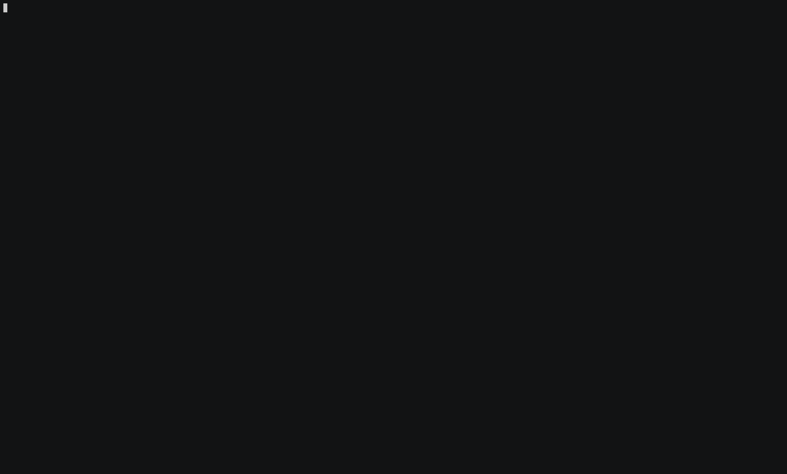

# Github Assets Cnb


<!--more-->


在構建 container image 時，有時候會有需求動態下載 Github repo 中的 Assets 檔案，簡單的方式就是在 `dockerfile` 透過 `curl` 指令來獲取檔案，如果是 private repo 時另外配置 `TOKEN` 即可

__dockerfile__

```dockerfile
ARG GITHUB_TOKEN=<github-token>
ARG REPO=qeek-dev/apitest-toolchain
ARG FILE=apitest-toolchain-linux-amd64
ARG VERSION=v0.1.0
ARG TARGET=apitest-toolchain

RUN ASSET_ID=$(if [ $VERSION != "latest" ]; then \
        echo $(curl -H "Authorization: token $GITHUB_TOKEN" -H "Accept: application/vnd.github.v3.raw" -s https://api.github.com/repos/$REPO/releases | jq ". | map(select(.VERSION == \"$VERSION\"))[0].assets | map(select(.name == \"$FILE\"))[0].id"); \
    else\
        echo $(curl -H "Authorization: token $GITHUB_TOKEN" -H "Accept: application/vnd.github.v3.raw" -s https://api.github.com/repos/$REPO/releases | jq ".[0].assets | map(select(.name == \"$FILE\"))[0].id"); \
    fi) \
    && curl -vLJo /tmp/$TARGET -H 'Accept: application/octet-stream' "https://$GITHUB_TOKEN:@api.github.com/repos/$REPO/releases/assets/$ASSET_ID" \
    && chmod +x /tmp/$TARGET && mv /tmp/$TARGET /bin
```

上述 `dockerfile` 可以分成二個部份
1. 透過 Github API 獲取對應 Asset ID
2. 透過 curl 下載對應 Asset ID 的實體檔案

也因為自己有這一個需求，所以 [cage1016/github-assets-cnb](https://github.com/cage1016/github-assets-cnb) 這一個 Buildapck 的專案就出現了

### cage1016/github-assets-cnb
> A Cloud Native Buildpack that Download Github Assets

基本上這一個 buildpack 就是透過 [paketo-buildpacks/packit](https://github.com/paketo-buildpacks/packit) 這一個 Buildpacks Utils Library 來實作，一定程度減輕了對 [buildpacks/spec](https://github.com/buildpacks/spec) 有點麻煩的規範

例如
- `github.com/paketo-buildpacks/packit/cargo`: 有提供對 metadata.dependencies 操作的函式
- `github.com/paketo-buildpacks/packit/postal`: 有提供 `Drop` 可以直接透過 http 來下載檔案

#### Usage

1. Create a folder

    ```bash
    mkdir -p sample-app
    ```

1. create `project.toml`, 這邊以下載 `skaffold` 為例，如果 Github Asset 是屬於 private repo，配置加上 `TOKEN` 即可

    ```bash
    cat <<EOF >> sample-app/project.toml
    # [[build.env]]
    # optional, github token for private assets
    # name = "TOKEN"
    # value = "<github-token>"

    # skaffold
    [[build.env]]
    # required
    name = "REPO"
    value = "GoogleContainerTools/skaffold"

    [[build.env]]
    # required
    name = "FILE"
    value = "skaffold-linux-amd64"

    [[build.env]]
    # optional, default set to FILE value
    name = "TARGET"
    value = "skaffold"

    [[build.env]]
    # optional, default set to 'latest'
    name = "VERSION"
    value = "v1.22.0"
    EOF
    ```

1. build container image with buildpack

    ```bash
    pack build test_assets_run --path ./sample-app \
        -b cage1016/github-assets-cnb@1.0.0 \
        --builder gcr.io/buildpacks/builder:v1 \
        && docker run --rm test_assets_run "skaffold version"
    ```

1. demo

    

1. 詳細實作的細節請至 [cage1016/github-assets-cnb](https://github.com/cage1016/github-assets-cnb) 查閱
