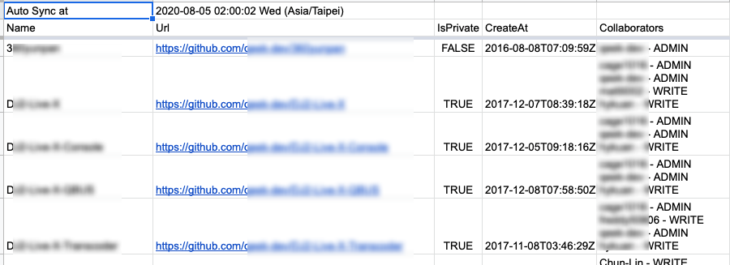
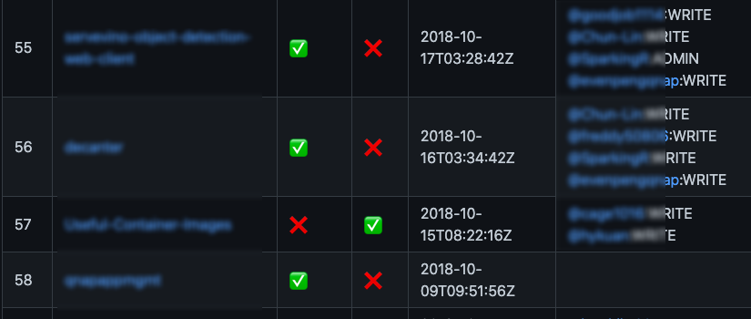
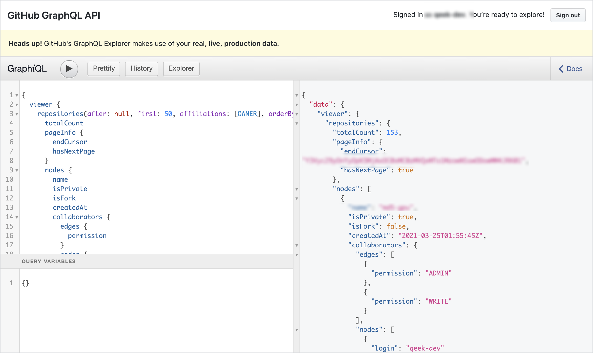
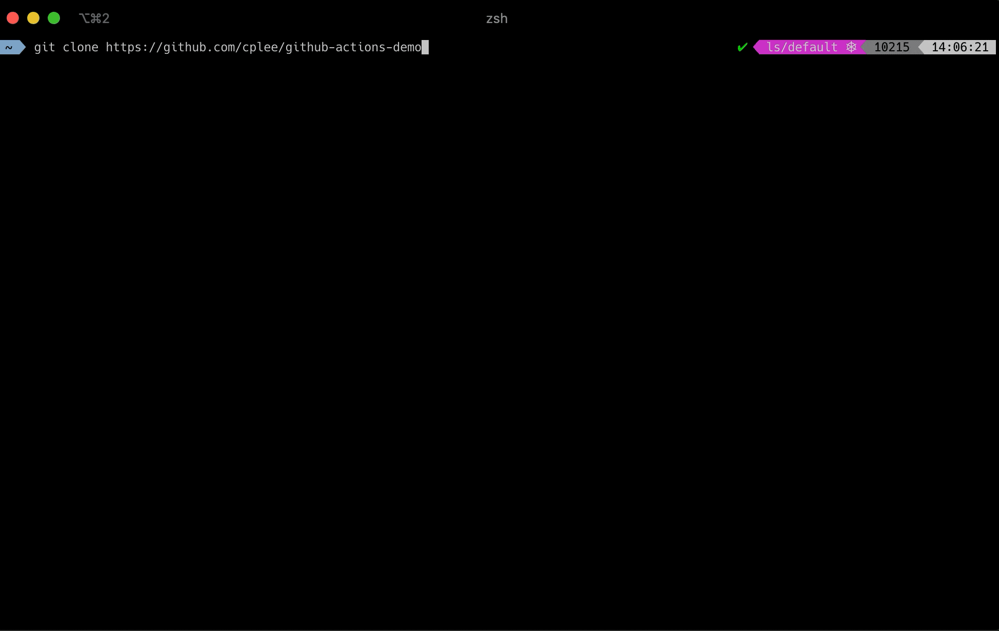

# Github Script Repos and Collaborators List Sync


<!--more-->






在 2018 年時為了公用帳號有一個 Github repostiories & collaborators 列表的需求，還特別在 GAE 上用 Golang 寫了一個服務並啟用 cron job

_cron.yaml_

```bash
cron:
    - description: "Sync Github Repo"
      url: /sync
      schedule: every 1 hours from 00:00 to 23:59
      timezone: Asia/Taipei
```

每一個小時用 Golang 呼叫 Github Graphql 取回來所有 Repo 列表，最後透過 Spreadsheet API 寫到特定的 Spreadsheet 中

- 需要開一個 Google Platform Platfrom 專案
- 部署 GAE 應用程式
- Golang 呼叫 Github Graphql 取資料
- Spreadsheet API 回寫資料

一這波操作下來是沒花到什麼錢啦，就是麻煩了一些，本來這個小東西跑的也好好的，最近最近人員的異動導至需要重新 review 大家的權限，Github 在 2019/11/3 正式推出了 Github Action，自己滿多 Repo 也早就在使用了，所以想說上述的需撾用 Github Action 重新實作會更來的容易些，事實上真的很方更，每一次 Action 的執行時間都不到 30 秒，就是快

在重構的時候也發現了許多非常棒的工具，也因此特別寫一篇文章來記錄一下

- [GitHub GraphQL API](https://docs.github.com/en/graphql/overview/explorer): Github Graphql Playground

  

- [nektos/act: Run your GitHub Actions locally 🚀](https://github.com/nektos/act): 不得不提這一個工具，可以在本地端開發測試 Github Action，本地就可以開發就是方便

  
  (pic https://github.com/nektos/act)

- [actions/github-script: Write workflows scripting the GitHub API in JavaScript](https://github.com/actions/github-script): 在寫 Github Action workflows scripts 時可以直接用 Javascript 呼到 Github API，包好了直接用方便

  ```js
  jobs:
    readme:
      runs-on: ubuntu-latest
      steps:
        - run: npm install tablemark
        - uses: actions/github-script@v4
          id: repository_collaborators
          with:
            github-token: ${{ secrets.REPO_TOKEN }}
            script: |
              const query = `query($endCursor: String = null) {
                viewer {
                  repositories(first: 100, after: $endCursor, affiliations: [OWNER], orderBy: {field: CREATED_AT, direction: DESC}) {
                    totalCount
                    pageInfo {
                      endCursor
                      hasNextPage
                    }
                    nodes {
                      name
                      createdAt
                      url
                    }
                  }
                }
              }`;

              const request = {
                owner: context.repo.owner,
                repo: context.repo.repo
              }
              const {data:collaboratorsData} = (await github.repos.getContent({
                ...request,
                path: 'collaborators.txt'
              }));
  ```

  `github.repos.getContent` Github API 直接封裝起來用一波

- [qeek-dev/github-project-sync: sync github projects & collaborators](https://github.com/qeek-dev/github-project-sync): Octokit plugin adding one method for all of api.github.com REST API endpoints

    這個網站提供了 API endpoints 的文件可以查詢

    EX:
    ```js
    octokit.rest.repos.getContent({
      owner,
      repo,
      path,
    });
    ```

### .github/workflows/cron.yml



基本的流程如下

1. Github Graphql 取回所有的 repos & collaborators, 需要 `github-token: ${{ secrets.REPO_TOKEN }}`
1. 準備 md 所需的資料
1. 使用 `tablemark` library 將 Array 轉換為 markdown
1. `if (Buffer.from(data.content, 'base64').compare(Buffer.from(result)) === 0) return`，比對新舊 `README.md` 檔案是否一致，不一樣才需要更新
1. `Buffer.from(data.content, 'base64').toString()`，如果需要取出 `github.repos.getContent` 中的值需要進行轉 base64 轉換

### 心得

如果專案放在 Github 上，Github action 真的可以作滿多事情的。[GitHub Marketplace](https://github.com/marketplace?type=actions) 也有非常多的資源可以用，不知道怎麼寫的話可以去援尋原始碼，真的推薦可以使用
