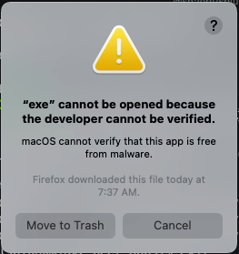
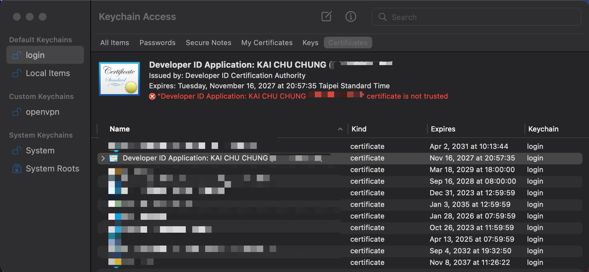
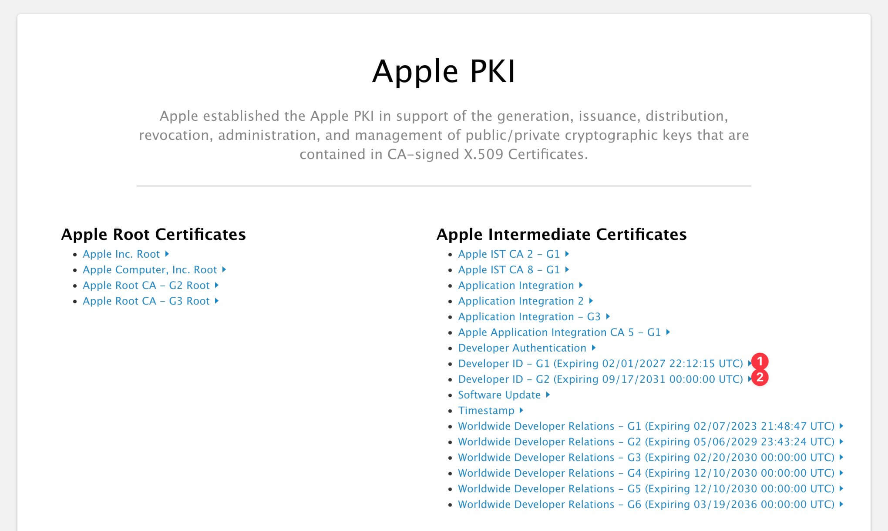
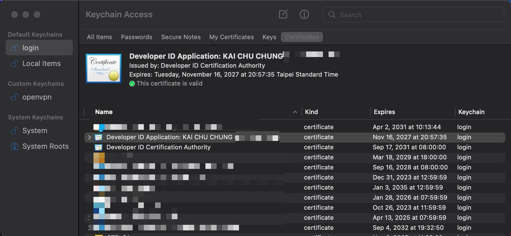

# Gon Sign ErrSecInternalComponent


<!--more-->

Recently, I've been using Golang with [deanishe/awgo](https://github.com/deanishe/awgo) to write Alfred Workflow, which I use a ton.

1. [alfred-pdf2image](https://github.com/cage1016/alfred-pdf2image) - Convert PDF to image with Alfred

2. [alfred-devtoys](https://github.com/cage1016/alfred-devtoys) - A Swiss Army knife for developers for Alfred

3. [alfred-paletter](https://github.com/cage1016/alfred-paletter) - Extract palette from an image

4. [ak](https://github.com/cage1016/ak) - A generator for golang alfred workflow that helps you create boilerplate code.

5. [alfred-opencc](https://github.com/cage1016/alfred-opencc) - Open Chinese Convert 開放中文轉換

6. [alfred-timelog](https://github.com/cage1016/alfred-timelog) - You could leverage Alfred and Google Sheets to track your time with ease. The goal is to track your time in a way that is easy to understand how much time you spend on.
7. [alfred-fork-open](https://github.com/cage1016/alfred-fork-open) - Alfred 5 workflow for opening folders in Fork.

In addtion to use them by myself, I also want to share them with others and publish them to [Alfred App Community Forum](https://www.alfredforum.com/forum/3-share-your-workflows/), which is a website that hosts Alfred workflows forum and allows users to share their workflows with others. When Apple introduced MacOS Catalina, it came with security features to ensure that you only use trusted binary files. This requires that binary files be signed and notarized by Apple itself, otherwise you'll get an error. This problem is encountered when using the `Golang` base Alfred Workflow.



Of course, it is possible to allow forced enable in the MacOS "Security and Privacy Preferences", but this would create a security problem for other users because there is no way to determine if the application being run is trusted. The correct way to do this is to request a "Developer ID Application" certificate and add the certificate to the compile command at compile time。Cause all of my workflows are written in `Golang` and publish by Github Action. So, this article document the problems I encountered with [Gon](https://github.com/mitchellh/gon) code sign and how I solved them by following the steps below from [Build, notarize, and sign Golang binaries for MacOS with GitHub Actions · KenCochrane.com](https://www.kencochrane.com/2020/08/01/build-and-sign-golang-binaries-for-macos-with-github-actions/)

## Gon

[Gon](https://github.com/mitchellh/gon) is a tool that allows you to sign and notarize your binaries with a single command and developed by [Hashicorp](https://www.hashicorp.com/) founder [Mitchell Hashimoto](https://github.com/mitchellh)

## Gon Prerequisite: Acquiring a Developer ID Certificate

1. Login to [Apple Developer](https://developer.apple.com/) and create a new certificate.
2. Visit [Certificates, Identifiers & Profiles](https://developer.apple.com/account/resources/certificates/list)
3. Click the + button to add a new certificate and select "Developer ID Application" at Software part and continue to follow the steps to create a new certificate.
4. Download `Developer ID Application` certificate and double click to install it into your keychain.

Verify that the certificate is installed by running the following command

```bash
$ security find-identity -v | grep Developer
  2) 20DFD3FCBB8283C498F07D784871F91353A270D3 "Developer ID Application: Name (5ST5F35WQV)"
```

## Gon local code sign

When certificate is ready, we could use [Gon](https://github.com/mitchellh/gon) to sign the binary file with `gon.json` configuare file.

__gon.json__

```bash
{
    "source" : ["./exe"],
    "bundle_id" : "com.kaichu.example.c",
    "apple_id": {
        "username" : "<your-email>",
        "password":  "@env:AC_PASSWORD"
    },
    "sign" :{
        "application_identity" : "Developer ID Application: KAI CHU CHUNG"
    }
}
```

```bash
$ gon -log-level=debug -log-json ./gon.json
==> ✏️  Signing files...
{"@level":"info","@message":"executing codesigning","@module":"sign","@timestamp":"2022-11-16T09:33:32.508890+08:00","command_args":["codesign","-s","Developer ID Application: KAI CHU CHUNG","-f","-v","--timestamp","--options","runtime","./exe"],"command_path":"/usr/bin/codesign","files":["./exe"]}
{"@level":"error","@message":"error codesigning","@module":"sign","@timestamp":"2022-11-16T09:33:32.599347+08:00","err":"exit status 1","output":"./exe: replacing existing signature\nWarning: unable to build chain to self-signed root for signer \"Developer ID Application: KAI CHU CHUNG (5ST5F35WQV)\"\n./exe: errSecInternalComponent\n"}
❗️ Error signing files:

error signing:

./exe: replacing existing signature
Warning: unable to build chain to self-signed root for signer "Developer ID Application: KAI CHU CHUNG (5ST5F35WQV)"
./exe: errSecInternalComponent
```

BOOM, we got an error `./exe: errSecInternalComponent` when we try to sign the binary file.

## Root Cause



This error is caused by the certificate is not trusted by the system and does not work that even we force enable trust manually in keychain. We could fix this by adding the intermediate certificate to the keychain. We could download the intermediate certificate from [Apple PKI - Apple](https://www.apple.com/certificateauthority/) website



There are two intermediate certificates for `Developer ID Application` certificate, we could download same type as `Developer ID Application` certificate we request in the beginning and install them into the keychain.

- Developer ID - G1 (Expiring 02/01/2027 22:12:15 UTC)
- Developer ID - G2 (Expiring 09/17/2031 00:00:00 UTC)



## Gon local code sign (success)

Re run the `gon` command again, we could see the binary file is signed successfully.

```bash
$ gon -log-level=debug -log-json ./gon.json
==> ✏️  Signing files...
{"@level":"info","@message":"executing codesigning","@module":"sign","@timestamp":"2022-11-16T14:05:09.694431+08:00","command_args":["codesign","-s","Developer ID Application: KAI CHU CHUNG","-f","-v","--timestamp","--options","runtime","./exe"],"command_path":"/usr/bin/codesign","files":["./exe"]}
{"@level":"info","@message":"codesigning complete","@module":"sign","@timestamp":"2022-11-16T14:05:10.537608+08:00","output":"./exe: replacing existing signature\n./exe: signed Mach-O universal (x86_64 arm64) [exe]\n"}
    Code signing successful

⚠️  No items to notarize
You must specify a 'notarize' section or a 'source' section plus a 'zip' or 'dmg' section in your configuration to enable packaging and notarization. Without these sections, gon
will only sign your input files in 'source'.
```

Verify the binary file is signed successfully by running the following command

```bash
$ codesign -dvv exe
Executable=/Users/kaichuchung/tmp/c/exe
Identifier=exe
Format=Mach-O universal (x86_64 arm64)
CodeDirectory v=20500 size=12015 flags=0x10000(runtime) hashes=370+2 location=embedded
Signature size=9058
Authority=Developer ID Application: KAI CHU CHUNG (5ST5F35WQV)
Authority=Developer ID Certification Authority
Authority=Apple Root CA
Timestamp=Nov 16, 2022 at 00:26:11
Info.plist=not bound
TeamIdentifier=5ST5F35WQV
Runtime Version=10.9.0
Sealed Resources=none
Internal requirements count=1 size=164
```

Now, we could use `gon` to sign and notarize the binary file successfully. The next step is to use `gon` to sign and notarize the binary file in Github Action relase pipeline.
