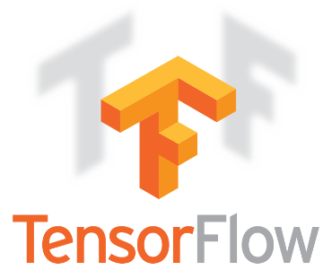

# COSCUP 2016 - NAS也會揀土豆

<!--more-->

今年在 [COSCUP](http://coscup.org/2016/schedules.html) 2016 上分享了「**NAS 也可以揀土豆**」主題。

> TensorFlow 是由 Google 所公布的開源機器學習平台，根據 Github 的數據統計，TensorFlow 成為2016年最受關注的十大開源專案之一。此次分享將介紹，如何在 NAS 上整合TensorFlow 及相關 Open source project，以展示幾種相關的資料分析應用。

## outline

- Machine learning
- Deep learning
  - Neural Network
  - Convolutional neural network
- Building a classifier for NAS
- Study information

## slide



## github demo repo

[cage1016/coscup2016-nas-session: Nas 也可以揀土豆](https://github.com/cage1016/coscup2016-nas-session)

## tips

在準備簡報的過程中也學習到了 Machine learning, Deep learning, Convolutional Neural Network(CNN) 的相關概念, 其實花了很多時候再分辨這其中的差異有什麼不同, 自己也是剛剛開始學習這門學科, 主題分享上算是入門給大家比較大一點的概念(也是自己的學習心得)

## Study information

- [Deep Learning | Udacity](https://www.udacity.com/course/deep-learning--ud730)
- [Research Blog: Train your own image classifier with Inception in TensorFlow](https://research.googleblog.com/2016/03/train-your-own-image-classifier-with.html)
- [jtoy/awesome-tensorflow: TensorFlow - A curated list of dedicated resources http://tensorflow.org](https://github.com/jtoy/awesome-tensorflow)
- [Deep Learning - Convolutional Neural Networks](http://www.slideshare.net/perone/deep-learning-convolutional-neural-networks)
- [Neural networks and deep learning](http://neuralnetworksanddeeplearning.com/chap1.html)
- [Multiple Component Learning](http://valse.mmcheng.net/ftp/20150312/dsn.pdf)
- [DIGITS/GettingStarted.md at master · NVIDIA/DIGITS](https://github.com/NVIDIA/DIGITS/blob/master/docs/GettingStarted.md)
- [How to Retrain Inception's Final Layer for New Categories](https://www.tensorflow.org/versions/r0.9/how_tos/image_retraining/index.html)
- [TensorFlow For Poets](https://codelabs.developers.google.com/codelabs/tensorflow-for-poets/index.html?index=..%2F..%2Findex#0)
- [DIY Deep Learning for Vision: a Hands-On Tutorial with Caffe - Google Slides](https://docs.google.com/presentation/d/1UeKXVgRvvxg9OUdh_UiC5G71UMscNPlvArsWER41PsU/edit#slide=id.gc2fcdcce7_216_48)
- [Caffe | Deep Learning Framework](http://caffe.berkeleyvision.org/)
- [Understanding Convolutional Neural Networks for NLP – WildML](http://www.wildml.com/2015/11/understanding-convolutional-neural-networks-for-nlp/)

