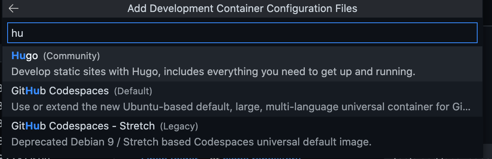
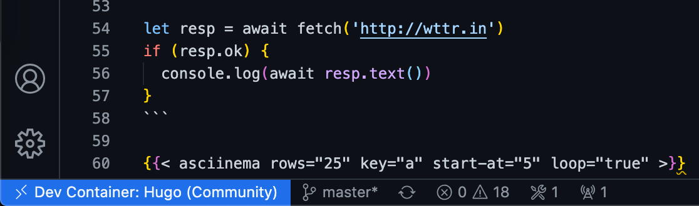
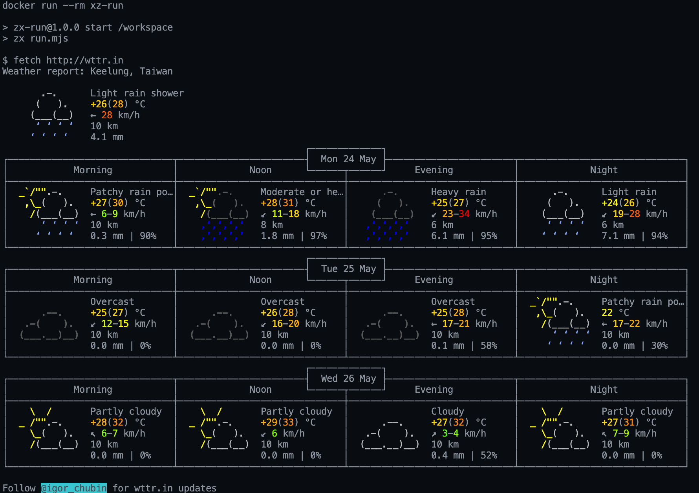

# Devcontainer Zx Pack


<!--more-->

身為一個開發者有時候會為了準個開發境而煩惱，例如 Golang/Node/Python 會有同時開發不同的版本的需求，雖然有如 `gvm`, `tj/n`, `pyenv` 等等的工具來幫我們來回切換不同的版本及環境，當電腦東西越裝越多難免還是會有打架的時候。[microsoft/vscode-dev-containers](https://github.com/microsoft/vscode-dev-containers) 這時候就是一個非常好用的工具，最近慢慢感覺到它的方便性

## microsoft/vscode-dev-containers

> A repository of development container definitions for the VS Code Remote - Containers extension and GitHub Codespaces

dev containers 是 vscode 的一個 Extension。簡的來說，就是透過 Container 有良好隔離性的特性來打造開發環境，官方已經提供了很多種開發環境可以直接使用，且這些 dev container 都可以自行修改 [Dockerfile](https://github.com/cage1016/devcontainer-zx-pack-devmo/blob/master/.devcontainer/Dockerfile), [devcontainer.json](https://github.com/cage1016/devcontainer-zx-pack-devmo/blob/master/.devcontainer/devcontainer.json) 來進行功能的擴充及參數配置





### Ex: Hugo

```json
	"name": "Hugo (Community)",
	"build": {
		"dockerfile": "Dockerfile",
		"args": {
			// Update VARIANT to pick hugo variant.
			// Example variants: hugo, hugo_extended
			// Rebuild the container if it already exists to update.
			"VARIANT": "hugo_extended",
			// Update VERSION to pick a specific hugo version.
			// Example versions: latest, 0.73.0, 0,71.1
			// Rebuild the container if it already exists to update.
			"VERSION": "latest",
			// Update NODE_VERSION to pick the Node.js version: 12, 14
			"NODE_VERSION": "14",
		}
	},
```

使用 `Hugo` 編寫 Blog 文章的人可以直接使用，如果需要使用 `hugo_extended` 的版本，直接在 `.devcontainer.json` 中進行置，再點選 `Rebuild Coontainer` 就好了

### Ex: GitHub Codespaces (Default Linux Universal)

> Use or extend the new Ubuntu-based default, large, multi-language universal container for GitHub Codespaces

另一個我覺得非常好用的是 [GitHub Codespaces (Default Linux Universal)](https://github.com/microsoft/vscode-dev-containers/blob/master/containers/codespaces-linux/README.md)

| Metadata | Value |  
|----------|-------|
| *Contributors* | The GitHub Codespaces team |
| *Categories* | Services, GitHub |
| *Definition type* | Dockerfile |
| *Published image* | mcr.microsoft.com/vscode/devcontainers/universal:linux<br />mcr.microsoft.com/vscode/devcontainers/universal:focal |
| *Published image architecture(s)* | x86-64 |
| *Works in Codespaces* | Yes |
| *Container host OS support* | Linux, macOS, Windows |
| *Container OS* | Ubuntu |
| *Languages, platforms* | Python, Node.js, JavaScript, TypeScript, C++, Java, C#, F#, .NET Core, PHP, PowerShell, Go, Ruby, Rust |

這一個 devcontainer base Image 跟 Github Codespaces 是一樣的。我們常用的 `Kubectl`, `helm` 等等工具都已經包好了，直接使用非常的方便，唯一的缺點就是 Container image 比較大，大約 10GB :joy:


## Google/xz

> google/zx: A tool for writing better scripts

```bash
#!/usr/bin/env zx

await $`cat package.json | grep name`

let branch = await $`git branch --show-current`
await $`dep deploy --branch=${branch}`

await Promise.all([
  $`sleep 1; echo 1`,
  $`sleep 2; echo 2`,
  $`sleep 3; echo 3`,
])

let name = 'foo bar'
await $`mkdir /tmp/${name}`
```

簡的來說就是 Bash Script 的加強版，可以使用 Javascript 來寫 Script, `await` 用一波

## devcontainer-zx-pack-devmo

- [microsoft/vscode-dev-containers: A repository of development container definitions for the VS Code Remote - Containers extension and GitHub Codespaces](https://github.com/microsoft/vscode-dev-containers)
- [google/zx: A tool for writing better scripts](https://github.com/google/zx)
- [GoogleCloudPlatform/buildpacks: Builders and buildpacks designed to run on Google Cloud's container platforms](https://github.com/GoogleCloudPlatform/buildpacks)

上面二節簡單的介紹了 microsoft/vscode-dev-containers & google/zx。二個東西加起來就是在 Container 裡面開發 Bash Script

最近有一個需求就非常適合的使用 microsoft/vscode-dev-containers & google/zx 且利用 Pack 建構 Container image 最終交給 Kubernetes cornjob 執行

在 backend API service 運維時期，Opertion 交求提供一份 Script 給 cron job 執行來確定 API 服務是否在可服務狀態。這一個題目就非常適合透過這樣的組合來完成，使用 Javascript 比純 Bash 來的容易編寫

在建構 Container image 時，我們使用 `pack` + GoogleCloudPlatform/buildpacks builder 輕鬆完成建構 Container image


1. 準備 `run.mjs`

    ```bash
    #!/usr/bin/env zx

    let resp = await fetch('http://wttr.in')
    if (resp.ok) {
      console.log(await resp.text())
    }
    ```

1. 建構 Container image

    ```bash
    pack build --builder=gcr.io/buildpacks/builder xz-run -p .
    ```

1. 執行 Container image

    ```bash
    pack build --rm xz-run
    ```

    

    

### Repo

https://github.com/cage1016/devcontainer-zx-pack-devmo
