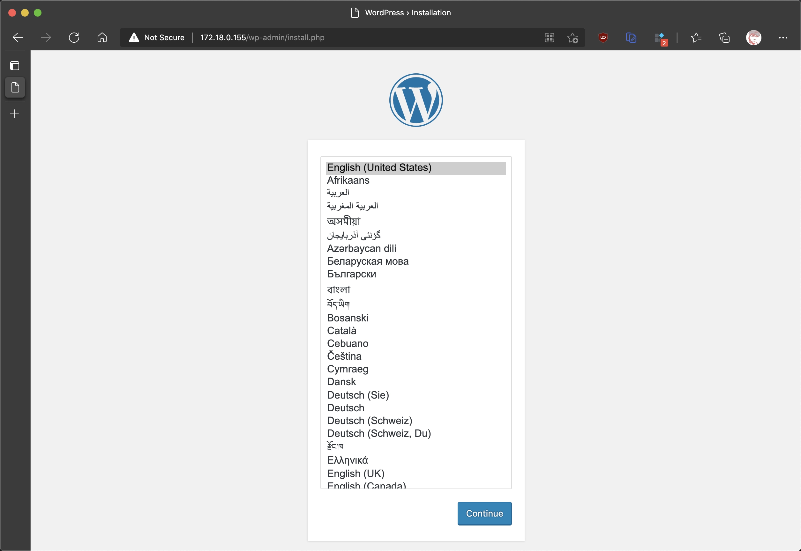

# Docker Tuntap Osx WordPress


<!--more-->

在 MacOS 上開發測試 Kubernetes 相關應用服務時，Kubernets cluster 有幾種選擇

- [minikube](https://minikube.sigs.k8s.io/docs/start/)
- [kind](https://kind.sigs.k8s.io/)
- [Docker Desktop on Mac](https://docs.docker.com/docker-for-mac/install/): 可以在設定中啟用 Kubernets

基本上都可以一定程度的在本地電腦上完成 Kubernets 相關的操作，不過由於 Docker Desktop on Mac 的限制並沒有將 Docker 的網路直接暴露給 Host 來存取，所以我們在本地端存取 Kubernets `LoadBalancer` type 的 Service 時會有一些不方便

這時候 [MetalLB, bare metal load-balancer for Kubernetes](https://metallb.universe.tf/) 一個透過標準路由協議支援 bare metal 的 LoadBalancer 就上場了，不過這時候還是因為剛剛說的 Docker Desktop on Mac 的硬限制，`不支援`。不過還有人提供了一些 workground 的方法 [christian-posta/docker-tuntap-osx: A tuntap shim installer for "Docker for Mac"](https://github.com/christian-posta/docker-tuntap-osx)，詳細的原理請至 Github Repo 中有說明，此編文章也算是給自己作的筆記

## Demo

本次會使用到的工具

- [Docker Desktop on Mac](https://docs.docker.com/docker-for-mac/install/)
- [christian-posta/docker-tuntap-osx: A tuntap shim installer for "Docker for Mac"](https://github.com/christian-posta/docker-tuntap-osx)
- [kind](https://kind.sigs.k8s.io/)
- [MetalLB, bare metal load-balancer for Kubernetes](https://metallb.universe.tf/)
- 建立一個 Wordpress 並使用 MetalLB 配置的 IP 來存取

### Steps

1. 安裝 [Docker Desktop on Mac](https://docs.docker.com/docker-for-mac/install/)
1. 安裝 `tuntap`
    ```bash
    brew install --cask tuntap
    ```
1. 退出 `Docker for Mac`
1. Git clone [christian-posta/docker-tuntap-osx](https://github.com/christian-posta/docker-tuntap-osx) repo
    ```bash
    git clone https://github.com/christian-posta/docker-tuntap-osx
    ```
1. 執行 shell 替換 Docker for Mac 的 hyperkit
    ```bash
    ./sbin/docker_tap_install.sh
    ```
1. 檢查 `tap` 是否存在
    ```bash
    ifconfig | grep "tap"
    ```
1. Tap up
    ```bash
    ./sbin/docker_tap_up.sh
    ```
1. 檢查 tap1 ，這時候應該會配置 IP Address, [brona/iproute2mac: CLI wrapper for basic network utilites on Mac OS X inspired with iproute2 on Linux systems - ip command.](https://github.com/brona/iproute2mac)
    ```bash
    ip a s | grep tap1
    tap1: flags=8843<UP,BROADCAST,RUNNING,SIMPLEX,MULTICAST> mtu 1500
      inet 10.0.75.1/30 brd 10.0.75.3 tap1
    ```
1. 透過 [kind](https://kind.sigs.k8s.io/) 建立 Kuberneter cluster
    ```bash
    kind create cluster --name wordpress-demo
    ```
1. Add static route:
    ```bash
    ./create-static-route.sh
    ```
1. Install metallab
    ```bash
    ./install-metallb.sh
    ```
1. Install WordPress
    ```bash
    kubectl apply -f https://gist.githubusercontent.com/cage1016/c2214d24db62d75218eb8bdbe236b93b/raw/3ed124f90f2f5154c393a2224910327c06258395/demo-secret.yaml
    kubectl apply -f https://gist.githubusercontent.com/cage1016/c2214d24db62d75218eb8bdbe236b93b/raw/3ed124f90f2f5154c393a2224910327c06258395/mysql-deployment.yaml
    kubectl apply -f https://gist.githubusercontent.com/cage1016/c2214d24db62d75218eb8bdbe236b93b/raw/3ed124f90f2f5154c393a2224910327c06258395/wordpress-deployment.yaml
    ```
1. Get Service IP
    ```bash
     EXTERNAL_IP=$(kubectl get svc wordpress -o jsonpath='{.status.loadBalancer.ingress[0].ip}')
     echo $EXTERNAL_IP
    ```
1. Launch 
    

## 心得

在 Docker for Mac 的硬限制之下，透過 [christian-posta/docker-tuntap-osx](https://github.com/christian-posta/docker-tuntap-osx) tuntap 的方式還是可以暫時的在 Mac 系統本地中使用 metallb，不過只要 Docker for Mac 重啟之後就必需重新 tuntap 一次，這個也是麻煩地方

在安全性考量之下，執行 `./sbin/*.sh` 還是養成好習慣，檢查一下 Scripts 確認沒問題之後再執行
