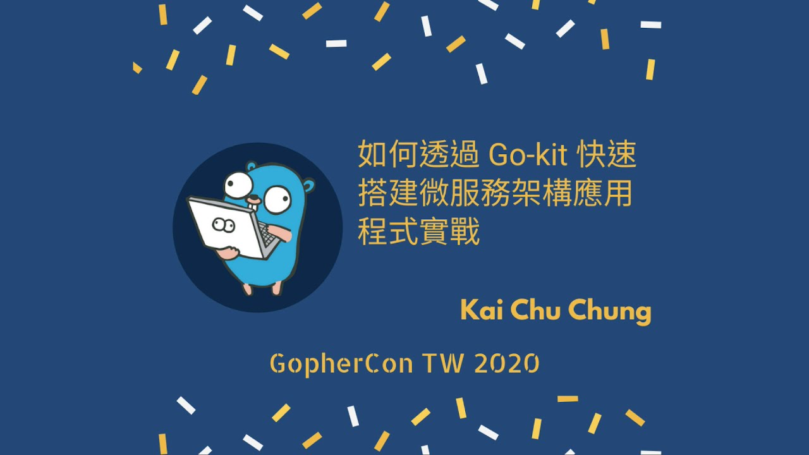

# GoPherCon 2020 TW: 如何透過 Go-kit 快速搭建微服務架構應用程式實戰


<!--more-->



在第一屆的 GopherCon TW 中分享 **如何透過 Go-kit 快速搭建微服務架構應用程式實戰**

### Aganda
- Go-kit
- Layout
- Test
- Toolchain

簡單的內容總結。第一部份還是簡單的說明 Go-kit 作為一個微服務工具包的設計理念及其中的模型分層 `Service`, `Endpoint` & `Transport`
，在小型的應用中進行架構強制分離會覺得有一點把問題複雜化。不過在微服務數量開始變多，開發人員變多的狀況下，架構強制分離好處效益就會出現。
進而在導入 Istio Service mesh 可以讓 Go-kit 核心概念保留，把微服務組件下放至 Istio 中進行處理，使單一微服務只需要專注商業邏輯開發

Layout 的部份就是基於 [golang-standards/project-layout: Standard Go Project Layout](https://github.com/golang-standards/project-layout) 進行一些檔案配置的安排, 配合架構強制分離讓開發者知道什麼東西該放在那裡

Test 部份依照 `Service`, `Transport` 分別進行相對應的 unitest，採用 table case 及 mock 概念

Toolchain 則強調，架構強制分離配合程式碼產生器可以加快開發的速度

### 補充資料

[Cloud Native Buildpacks · Cloud Native Buildpacks](https://buildpacks.io/) 是 CNCF 下面的一個專案，簡單來說就是透過 container 的方式來幫你從原始碼打包 container image 而不需要編寫 Dockerfile, Google 也在今年的 Cloud Next 20' OnAir 上宣佈 `Cloud Build`, `Cloud Run`, `Cloud Shell`, `Cloud Function`, `Cloud Code` & `Skafflold` 都已經原生支援 [GoogleCloudPlatform/buildpacks](https://github.com/GoogleCloudPlatform/buildpacks)

```shell
Suggested builders:
	Google:                gcr.io/buildpacks/builder:v1      Ubuntu 18 base image with buildpacks for .NET, Go, Java, Node.js, and Python
	Heroku:                heroku/buildpacks:18              heroku-18 base image with buildpacks for Ruby, Java, Node.js, Python, Golang, & PHP
	Paketo Buildpacks:     paketobuildpacks/builder:base     Ubuntu bionic base image with buildpacks for Java, NodeJS and Golang
	Paketo Buildpacks:     paketobuildpacks/builder:full     Ubuntu bionic base image with buildpacks for Java, .NET, NodeJS, Golang, PHP, HTTPD and NGINX
	Paketo Buildpacks:     paketobuildpacks/builder:tiny     Tiny base image (bionic build image, distroless run image) with buildpacks for Golang
```
上面列出的是目前建議的實作 buildpack 的 builders，每一家 builder 提供的參數可能有些不一樣，就請大家參照各別的說明文件

### 影片



### 投影片

https://www2.slideshare.net/cagechung/gokit-239269720



### 投影片中相關的 demo
- [cage1016/gokit-workshop](https://github.com/cage1016/gokit-workshop) Simple tutorial from http/net to Gokit skeleton
- [cage1016/ms-demo: gokit microservice demo](https://github.com/cage1016/ms-demo) gokit microservice demo
- [cage1016/gk at feature/gokitconsulk8sistio](https://github.com/cage1016/gk/tree/feature/gokitconsulk8sistio) gokit toolchain
