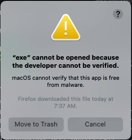
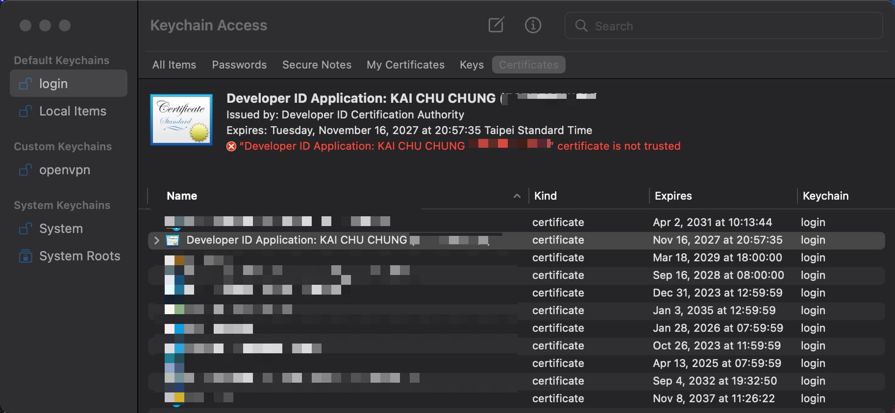
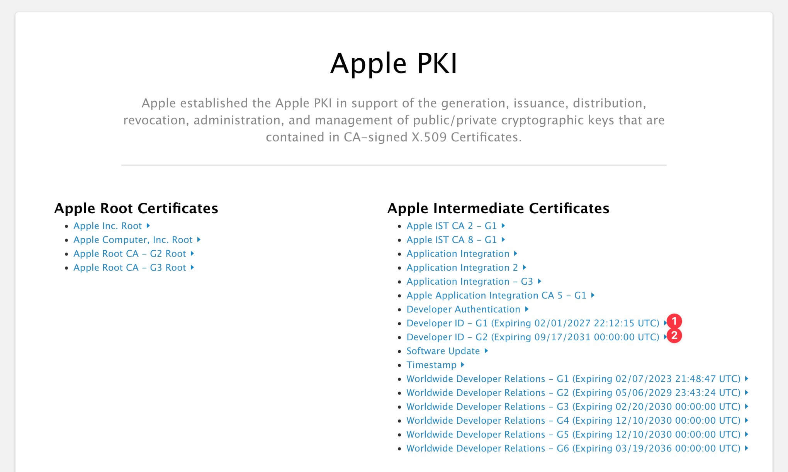
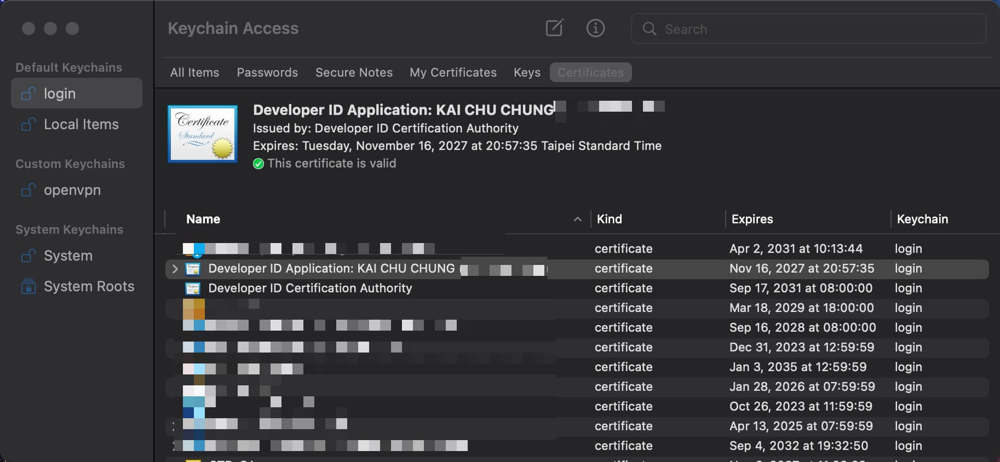

# Gon Sign ErrSecInternalComponent


<!--more-->

最近常常透過 `Golang` + [deanishe/awgo](https://github.com/deanishe/awgo) 來編寫自己經常使用的 `Alfred Workflow`

1. [alfred-pdf2image](https://github.com/cage1016/alfred-pdf2image) - Convert PDF to image with Alfred

2. [alfred-devtoys](https://github.com/cage1016/alfred-devtoys) - A Swiss Army knife for developers for Alfred

3. [alfred-paletter](https://github.com/cage1016/alfred-paletter) - Extract palette from an image

4. [ak](https://github.com/cage1016/ak) - A generator for golang alfred workflow that helps you create boilerplate code.

5. [alfred-opencc](https://github.com/cage1016/alfred-opencc) - Open Chinese Convert 開放中文轉換

6. [alfred-timelog](https://github.com/cage1016/alfred-timelog) - You could leverage Alfred and Google Sheets to track your time with ease. The goal is to track your time in a way that is easy to understand how much time you spend on.
7. [alfred-fork-open](https://github.com/cage1016/alfred-fork-open) - Alfred 5 workflow for opening folders in Fork.

除了自用之外，也會將這些 workflow 發布到 [Alfred App Community Forum](https://www.alfredforum.com/forum/3-share-your-workflows/) 上，讓更多人可以使用。當 Apple 推出 MacOS Catalina 時，它帶有一些安全功能，以確保你只使用受信任的二進位制檔案。這要求二進位制檔案由蘋果公司自己簽署和公證，否則你會得到一個錯誤。。當在 Alfred Workflow 使用 `Golang` 編譯執行時就會遇到這個問題。



當然可以在 MacOS `Security & Privacy preferences` 中允強制開啟，但這樣會導致其他使用者的安全疑慮，因為無法確定正在執行的應用程式是否是可信任的。正規的作法就是申請一個 `Developer ID Application` 的憑證，並在編譯時將憑證加入編譯指令中。由於我自已所寫的 Alfred workflow 都是透過 Github Action 編譯完成，所以這篇文章是在依照 [Build, notarize, and sign Golang binaries for MacOS with GitHub Actions · KenCochrane.com](https://www.kencochrane.com/2020/08/01/build-and-sign-golang-binaries-for-macos-with-github-actions/) 說明操作的過程中遇到 `codesign` 的問題並記錄下解決的處理過程。

## Gon

[Gon](https://github.com/mitchellh/gon) 是由 [Hashicorp](https://www.hashicorp.com/) Founder 的 [Mitchell Hashimoto](https://github.com/mitchellh) 所編寫的，可以讓整個 code sign 的過程變的容易, 上述提到的解決方案也是透過 Gon 來完成的。

## Gon Prerequisite: Acquiring a Developer ID Certificate

1. 登入 [developer.apple.com](https://developer.apple.com/)
2. 訪問 [Certificates, Identifiers & Profiles](https://developer.apple.com/account/resources/certificates/list)
3. 點選 `Certificates +` 選單, 在 Software 中選擇 `Developer ID Application` 並操照畫面指示完成申請
4. 下載 `Developer ID Application` 憑證，雙擊安裝至 `Keychain Access` 中

透過 keychain access 來檢查憑證是否安裝成功

```bash
$ security find-identity -v | grep Developer
  2) 20DFD3FCBB8283C498F07D784871F91353A270D3 "Developer ID Application: Name (5ST5F35WQV)"
```

## Gon local code sign

準備好憑證後，就可以透過 [Gon](https://github.com/mitchellh/gon) 來完成 code sign 的動作了。準備好 `gon.json` 設定檔，並透過 `gon` 指令來完成 code sign 的動作。

__gon.json__

```bash
{
    "source" : ["./exe"],
    "bundle_id" : "com.kaichu.example.c",
    "apple_id": {
        "username" : "<your-email>",
        "password":  "@env:AC_PASSWORD"
    },
    "sign" :{
        "application_identity" : "Developer ID Application: KAI CHU CHUNG"
    }
}
```

```bash
$ gon -log-level=debug -log-json ./gon.json
==> ✏️  Signing files...
{"@level":"info","@message":"executing codesigning","@module":"sign","@timestamp":"2022-11-16T09:33:32.508890+08:00","command_args":["codesign","-s","Developer ID Application: KAI CHU CHUNG","-f","-v","--timestamp","--options","runtime","./exe"],"command_path":"/usr/bin/codesign","files":["./exe"]}
{"@level":"error","@message":"error codesigning","@module":"sign","@timestamp":"2022-11-16T09:33:32.599347+08:00","err":"exit status 1","output":"./exe: replacing existing signature\nWarning: unable to build chain to self-signed root for signer \"Developer ID Application: KAI CHU CHUNG (5ST5F35WQV)\"\n./exe: errSecInternalComponent\n"}
❗️ Error signing files:

error signing:

./exe: replacing existing signature
Warning: unable to build chain to self-signed root for signer "Developer ID Application: KAI CHU CHUNG (5ST5F35WQV)"
./exe: errSecInternalComponent
```

BOOM, 報錯了 `errSecInternalComponent`

## Root Cause



我們建立 `Developer ID Application` 下載的憑證並沒有被信任，當然可以手動強制信任，但是這樣進行 code sign 還是會一樣報錯。正式解決的方式就是透過 [Apple PKI - Apple](https://www.apple.com/certificateauthority/) 來找到 Apple 中級證書，並下載後安裝到 `Keychain Access` 中。



在 [Apple PKI - Apple](https://www.apple.com/certificateauthority/) 中相關的 Developer ID 有二個中級證書，需要依照一開始申請 Developer ID Application 時所選擇的類別來下載。

- Developer ID - G1 (Expiring 02/01/2027 22:12:15 UTC)
- Developer ID - G2 (Expiring 09/17/2031 00:00:00 UTC)



## Gon local code sign (success)

重新使用 [Gon](https://github.com/mitchellh/gon) 進行 code sign

```bash
$ gon -log-level=debug -log-json ./gon.json
==> ✏️  Signing files...
{"@level":"info","@message":"executing codesigning","@module":"sign","@timestamp":"2022-11-16T14:05:09.694431+08:00","command_args":["codesign","-s","Developer ID Application: KAI CHU CHUNG","-f","-v","--timestamp","--options","runtime","./exe"],"command_path":"/usr/bin/codesign","files":["./exe"]}
{"@level":"info","@message":"codesigning complete","@module":"sign","@timestamp":"2022-11-16T14:05:10.537608+08:00","output":"./exe: replacing existing signature\n./exe: signed Mach-O universal (x86_64 arm64) [exe]\n"}
    Code signing successful

⚠️  No items to notarize
You must specify a 'notarize' section or a 'source' section plus a 'zip' or 'dmg' section in your configuration to enable packaging and notarization. Without these sections, gon
will only sign your input files in 'source'.
```

透過 `codesign` 指令來檢查 code sign 結果

```bash
$ codesign -dvv exe
Executable=/Users/kaichuchung/tmp/c/exe
Identifier=exe
Format=Mach-O universal (x86_64 arm64)
CodeDirectory v=20500 size=12015 flags=0x10000(runtime) hashes=370+2 location=embedded
Signature size=9058
Authority=Developer ID Application: KAI CHU CHUNG (5ST5F35WQV)
Authority=Developer ID Certification Authority
Authority=Apple Root CA
Timestamp=Nov 16, 2022 at 00:26:11
Info.plist=not bound
TeamIdentifier=5ST5F35WQV
Runtime Version=10.9.0
Sealed Resources=none
Internal requirements count=1 size=164
```

這樣就可以將 [Gon](https://github.com/mitchellh/gon) 透過 code sign 的步驟，代入到 GitHub Actions 來進行 Alfred workflow code sign
