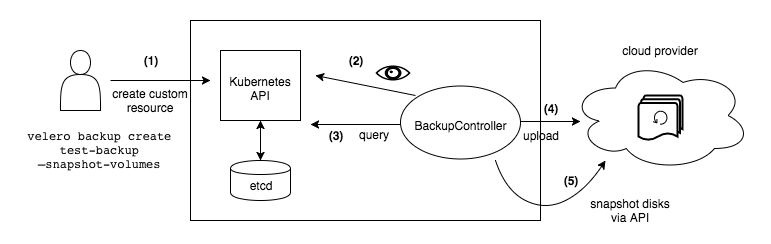

# Velero 初探簡報

<!--more-->



[Velero 初探與實踐 - KaiChu](https://kaichu.io/posts/velero-research-practice/)

> Velero 初探與實踐是研究 Velero 的一些心得，及使用 Velero + Restic 進行跨 Provider 遷移集群的原理、注意事項及操作的過程，成功的將 Mac 本地的 KIND k8s 中的 Rocketchat workload 無縫的遷移到 GKE 中，中間的過程還算是簡單方便(如果沒有跨 Provider 有 Cloud Provider 的原生支援會更快速)，算是一個開源友好的集群遷移工具，不過魔鬼總是藏在細節中，官方文件最好是好好的看一看，要了解其中的限制

本份簡報就是基於這個前提之下產生的，在整個 Velero 的研究過程中反饋的心得。從 Velero 介紹/安裝/基本使用方式/實踐。簡報的內容也同時發佈在 [Velero search &amp; practice 20210609](https://www.slideshare.net/cagechung/velero-search-amp-practice-20210609)，另外再補充幾種 Kubernetes 遷移類型操作的說明

## Backup from KIND and Restore to KIND

[KIND](https://kind.sigs.k8s.io/) 是一個使用 Docker container 在本地跑 Kubernetes 集群的一個決解方案，適合作一些測試用。在我們提到 Velero 備份時包含了二個部份，一是 Kubernetes 範圍內的資源(會 tar 起來儲放在 bucket 中)，另一種就是永久磁碟區

Velero 會備份所有類型的永久磁碟區(`hostpath` 除外)。我們在本地使用 KIND 部署 Kubernetes 也沒有如雲端供應商一樣有自動永久磁碟區佈建的功能，所以我們必需如上圖所示，手動在 KIND Kuberneretes 中配置本地永久磁碟區(綁定 KIND node)

前置作業完成之後，就可以搭配 `Restic` + `Minio` 一起完成在本地 Kuberetes 中對 `Rocketchat` 備份及復原的操作

## Backup from GKE and Restore to GKE

雲端供應商提供的 Kubernetes 集群對於永久磁碟區都有自動佈建的功能，所以開發者只需要聲明相關的 `PVC` 即可，對於三大雲端應商 (AWS, GCP, Azure) 都有 Velero 維護提供對應的 Plugin 及對接說明，且三大雲端應商的 Kubernetes 集群也都有支援原生的永久磁碟區快照功能。如果備份及遷移在同一個雲端供應商的情境，整個操作過程更為輕鬆

## Migrate KIND to GKE

跨供應商的 Velero 備份及遷移情境就會複雜一些。在本地 KIND Kubernetes 集群因為基本的限制就需要使用手動部署本地永久磁碟區 + `Restic` + `Minio`。因為 `Minio` 是 S3 相容的 Object Store 解決方案，就可以使用 `s3cmd` 將本地 KIND Kubernetes 中的備份檔(Kubernetes metadata/restic persistent volume)下載至本地電腦。在另一個供應商建立新的 Kubernetes 集群復原 `Minio` 備份(從本地上傳)，再使用 Velero restore 進行 workload 的復原。

以上的操作也可能會因為跨不同的供應商有所不同

## 心得

整個初探與實踐都是基於 Velero 1.6 版本的文件來製作完成。跟 Etcd 的備份比較來說，Velero 提供了更細粒度的備份復原功能。基本的操作概念就是上面的備份流程，不過魔鬼總是藏在細節中，實際上還會有效能/資源配置(cpu/menory)需要詳加考慮的部份，原則上就是要小心服用
